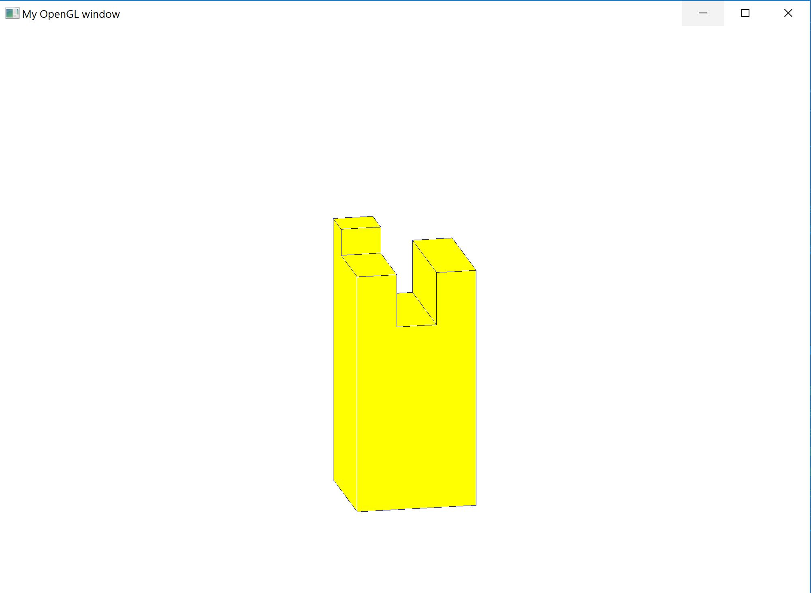

# DISCO JOINT

python 3.6.0

Environment setup as YouTube tutorial: https://www.youtube.com/watch?v=Ctfs-E_9rLE

setup/disco_joint_interface.py

Hit ESC key to quit
Rotate view with mouse (not yet implemented)
Edit joint geometry with: Y U I \ H J K \ B N M
Edit joint type with: 1 L T X (not yet implemented)
Press S to save joint geometry and O to open last saved geometry (not yet implemented)

