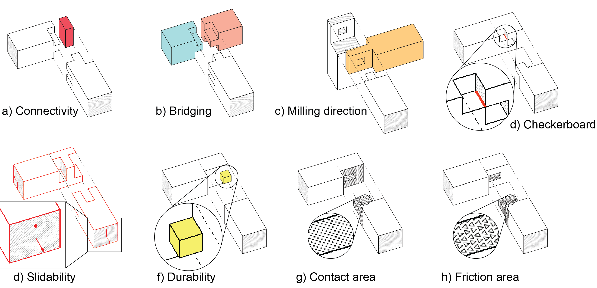

# Tsugite: Interactive Design and Fabrication of Wood Joints

This is the repository related to a paper presented at UIST 2020.
It is an interface where you can model a joint geometry in a voxelized design space, and export milling paths for fabrication with a 3-axis CNC-machine.

The system performs geometric evaluations in real time and provides graphical feedback accordingly (see image below).

This software is free for personal use and non-commercial research conducted within non-commercial organizations.
If you want to use it for commercial purposes, please contact Kaoru Shigeta (shigeta[at]todaitlo.jp) or Maria Larsson (ma.ka.larsson@gmail.com).

### Environment Requirements
Python 3.8.3

OpenGL

PyQt5 1.9.0

OpenCV 4.4.0.44

numpy 1.18.5

### Run program
Run setup/tsugite_app.py

### Publication
Maria Larsson, Hironori Yoshida, Nobuyuki Umetani, and Takeo Igarashi. 2020. Tsugite: Interactive Design and Fabrication of Wood Joints. In Proceedings of the 32nd Annual ACM Symposium on User Interface Software and Technology (UIST '20). Association for Computing Machinery, Virtual Event, USA.

Project page: http://www.ma-la.com/tsugite.html

ACM link: https://dl.acm.org/doi/abs/10.1145/3379337.3415899

### Disclaimer
Please note that this is a research prototype and not a consumer-ready product.
We cannot provide technical support and we are not responsible for any damage to your fabrication equipment.
