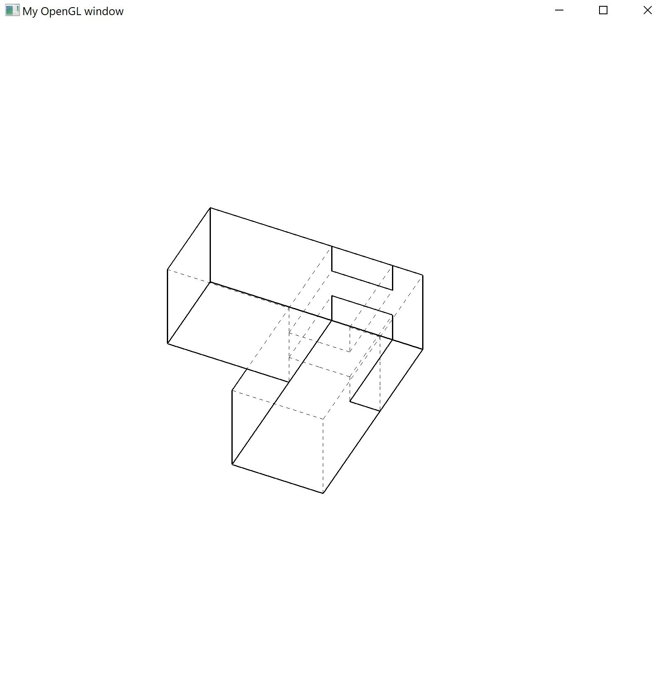

# DISCO JOINT

python 3.6.0

Environment setup as YouTube tutorial: https://www.youtube.com/watch?v=Ctfs-E_9rLE

setup/main.py

Hit ESC key to quit.

Rotate view with mouse / Double click mouse to start constant rotation

Edit joint geometry with: Y U I / H J K / B N M

Edit joint type with: 1 L T X

Open/close joint with: C

Turn on/off component view with: A / D

Turn on/off hidden lines with: E

Press S to save joint geometry and O to open last saved geometry (not yet implemented)

