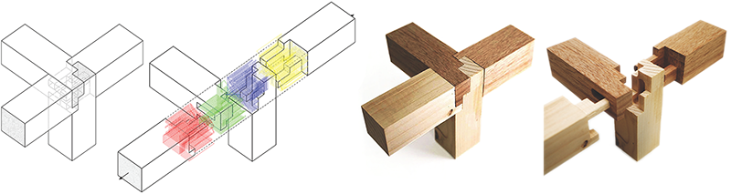
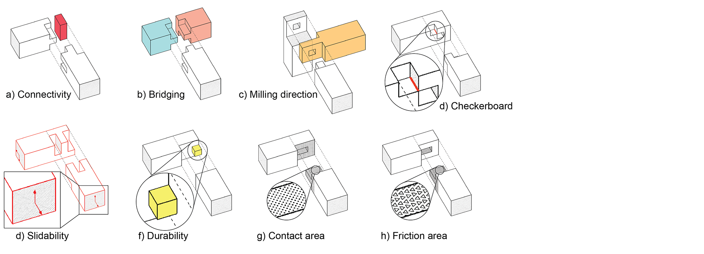
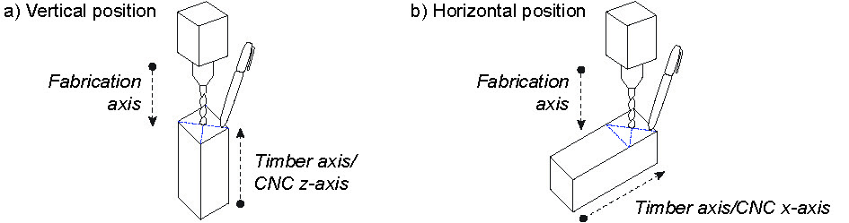

# Tsugite
## Interactive Design and Fabrication of Wood Joints

This is the repository related to a paper presented at UIST 2020.
It is an interface where you can model a joint geometry in a voxelized design space, and export milling paths for fabrication with a 3-axis CNC-machine.

The system performs geometric evaluations in real time and provides graphical feedback accordingly (see a-h below).

This software is free for personal use and non-commercial research conducted within non-commercial organizations.
If you want to use it for commercial purposes, please contact Kaoru Shigeta (shigeta@todaitlo.jp) or Maria Larsson (ma.ka.larsson@gmail.com).

### Environment Requirements

Python 3.8.3

OpenGL 3.1.5

PyQt5 5.15.1

OpenCV 4.4.0.44

Pillow 7.2.0

numpy 1.18.5

pyrr 0.10.3

### Run Program
Run setup/tsugite_app.py

### Fabrication
Set machine origin at the center of the top side of the joint.
Insert wood bar a) vertically if the sliding/fabrication is aligned with the timber axis, and b) horizontally if it is perpendicular to the timber axis.

### Disclaimer
Please note that this is a research prototype and not a consumer-ready product.
We cannot provide technical support and we are not responsible for any damage to your fabrication equipment.

### Publication
Maria Larsson, Hironori Yoshida, Nobuyuki Umetani, and Takeo Igarashi. 2020. Tsugite: Interactive Design and Fabrication of Wood Joints. In Proceedings of the 32nd Annual ACM Symposium on User Interface Software and Technology (UIST '20). Association for Computing Machinery, Virtual Event, USA.

ACM link: https://dl.acm.org/doi/abs/10.1145/3379337.3415899

Project page: http://www.ma-la.com/tsugite.html
